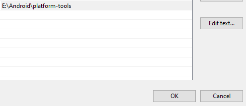
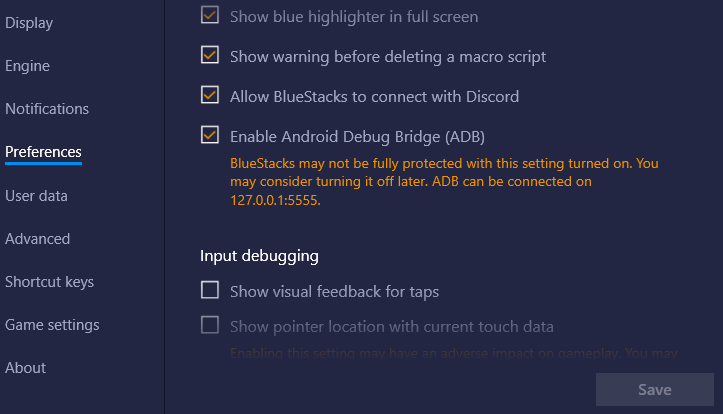

# Epic7Luna

**Author's note (2024-01-29):** Deciding to open-source this as I have not been using this tool in the last 2 years now. This application likely still works as the secret shop has not had any changes since release; however, it might be quicker to reverse engineer the API which each refresh + purchase calls instead of waiting for the UI to have to load every single time to do OCR. I have some ideas about this, but am not motivated enough to do this (yet). Regardless, if you're interested feel free to ping me! - Omar

This auto-refresher for Epic Seven saves you the time of shop-refreshing by doing it automagically for you.

<p align="center">
    </img>
</p>

## Getting started

There are a few steps involved with getting this set up. This guide is for windows 10 only.

### Step 1: Installing ADB

Install ADB onto your device by clicking this: [link](https://dl.google.com/android/repository/platform-tools-latest-windows.zip)

Now unzip and move to a folder of your choosing. Remember that folder! We will need it later.

### Step 2: Adding ADB to path

- go to Control Panel > System and Security > System and click on `Advanced system settings`
- click on `environment variables` on the bottom right
- in `System variables`, edit the Path variable by double clicking on the `Path`
- click on `new` and paste the path of the `adb.exe` file that was extracted in step 1

    Something similar to this:

    
- Now click OK to get rid of all the windows

### Step 3: Enabling ADB on bluestacks

- Go to settings on the bluestack instance
- Go to preferences
- Scroll down and make sure `Enable Android Debug Bridge (ADB)` is enabled

    Something like this:

    

### Step 4: Installing Tesseract

Install either the 32 bit or 64 bit tesseract installer from [here](https://github.com/UB-Mannheim/tesseract/wiki)

### Step 5: Install python

Make sure python is installed on your machine. Link is [here](https://www.python.org/downloads/windows/)

### Step 6: Install python dependencies

Open a command prompt and navigate to where this project was downloaded to. Run

```sh
uv lock
```

### Step 6: Connect ADB to the emulator ADB

Connect to the bluestacks ADB

```sh
adb connect localhost:5555
```

Now run

```sh
adb devices -l
```

and note down the name of the device.

For example, the device name of the following would be `localhost:5555`:

```sh
List of devices attached
localhost:5555         device product:OnePlus3 model:ONEPLUS_A3010 device:OnePlus3T transport_id:2
```

### Step 7: Set up config.yml

Open config.yml and make sure everything in there looks correct. Change the device name if needed.

### Step 8: Run the script

In a command prompt, run

```sh
uv run Epic7Luna --refresh
```

## Improvements / Suggestions

If you want a better match for images, look in `/matches` for the matching images:


Other than that, message me for improvements.
